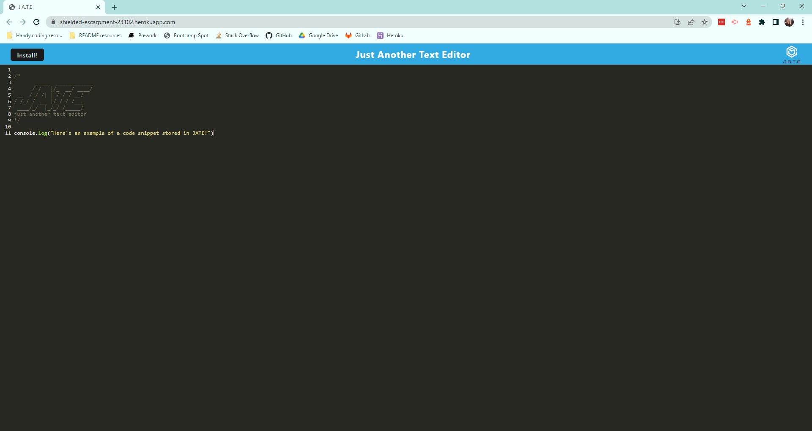
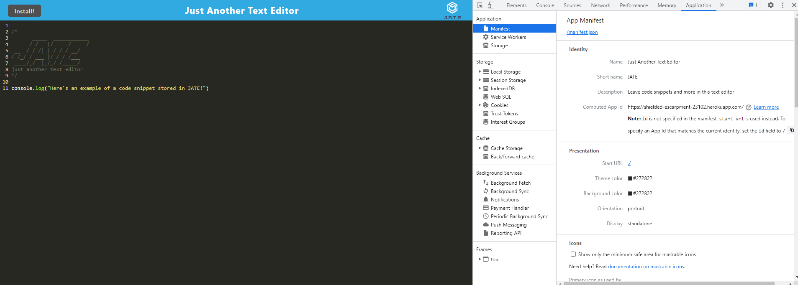
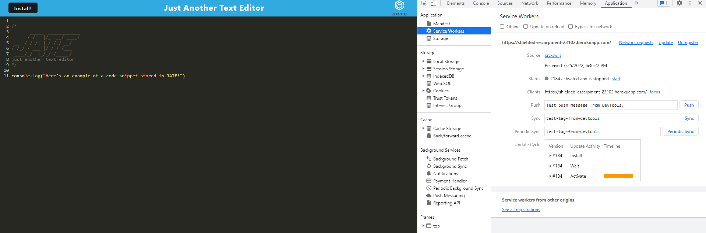
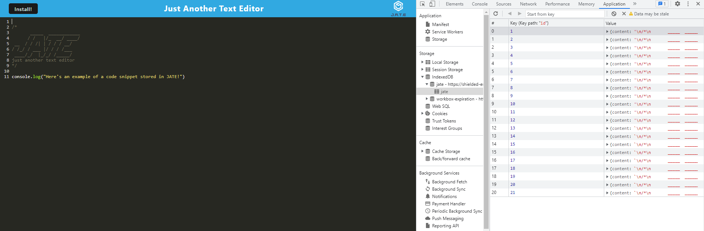
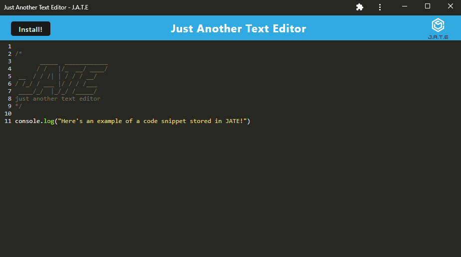

# Text-editor-PWA


## Description

This project's main task was to build a text editor that runs in the browser and can be installed to be used as a desktop app.

Starter code was provided, so the project focussed primarily on:

- Adding the scripts in the `package.json` file in the `root` directory, so that it could be deployed correctly to `Heroku`
- Adding logic to `database.js` for PUT and GET functions
- Adding event handlers to the prompts within the `install.js` file
- Adding and configuring workbox plugins for a service worker and manifest.json file in the `webpack.config.js` file
- Adding CSS loaders and babel to the `webpack.config.js` file
- Implementing asset caching in the `src-sw.js` file

> You can view the final, deployed application here: https://shielded-escarpment-23102.herokuapp.com/

## Table of contents

- [User story](#user-story)
- [Acceptance criteria](#acceptance-criteria)
- [Technologies used/built with](#technologies-usedbuilt-with)
- [Installation](#installation)
- [Usage](#usage)
- [Credits](#credits)
- [License](#license)

## User story

```
AS A developer
I WANT to create notes or code snippets with or without an internet connection
SO THAT I can reliably retrieve them for later use
```

## Acceptance criteria

```
GIVEN a text editor web application
WHEN I open my application in my editor
THEN I should see a client server folder structure
WHEN I run `npm run start` from the root directory
THEN I find that my application should start up the backend and serve the client
WHEN I run the text editor application from my terminal
THEN I find that my JavaScript files have been bundled using webpack
WHEN I run my webpack plugins
THEN I find that I have a generated HTML file, service worker, and a manifest file
WHEN I use next-gen JavaScript in my application
THEN I find that the text editor still functions in the browser without errors
WHEN I open the text editor
THEN I find that IndexedDB has immediately created a database storage
WHEN I enter content and subsequently click off of the DOM window
THEN I find that the content in the text editor has been saved with IndexedDB
WHEN I reopen the text editor after closing it
THEN I find that the content in the text editor has been retrieved from our IndexedDB
WHEN I click on the Install button
THEN I download my web application as an icon on my desktop
WHEN I load my web application
THEN I should have a registered service worker using workbox
WHEN I register a service worker
THEN I should have my static assets pre cached upon loading along with subsequent pages and static assets
WHEN I deploy to Heroku
THEN I should have proper build scripts for a webpack application
```

## Technologies used/built with

This project used the following technologies to build it:

- JavaScript
- [Express.js](https://expressjs.com/)
- [if-env](https://www.npmjs.com/package/if-env)
- [concurrently](https://www.npmjs.com/package/concurrently)
- [nodemon](https://nodemon.io/)
- [@babel/core](https://www.npmjs.com/package/@babel/core)
- [@babel/plugin-transform-runtime](https://babeljs.io/docs/en/babel-plugin-transform-runtime)
- [@babel/preset-env](https://babeljs.io/docs/en/babel-preset-env)
- [@babel/runtime](https://babeljs.io/docs/en/babel-runtime)
- [babel-loader](https://www.npmjs.com/package/babel-loader)
- [css-loader](https://webpack.js.org/loaders/css-loader/)
- [html-webpack-plugin](https://webpack.js.org/plugins/html-webpack-plugin/)
- [http-server](https://www.npmjs.com/package/http-server)
- [style-loader](https://webpack.js.org/loaders/style-loader/)
- [webpack](https://webpack.js.org/)
- [webpack-cli](https://webpack.js.org/api/cli/)
- [webpack-dev-server](https://webpack.js.org/configuration/dev-server/)
- [webpack-pwa-manifest](https://www.npmjs.com/package/webpack-pwa-manifest)
- [workbox-webpack-plugin](https://www.npmjs.com/package/workbox-webpack-plugin)
- [code-mirror-themes](https://www.npmjs.com/package/code-mirror-themes)
- [idb](https://www.npmjs.com/package/idb)

## Installation

1. Clone the repo (HTTPS: `git clone https://github.com/CharDige/Text-editor-PWA.git` or SSH: `git clone git@github.com:CharDige/Text-editor-PWA.git`)

2. Install all NPM packages by running `npm i` in the command-line. This will also make sure  the npm packages are either installed as `dependencies` as well as `devDependencies`.

## Usage

Below, you will find screenshots of the final, deployed application in the browser and as a desktop app. It will also include screenshots that show the service worker, manifest.json and IndexeDB storage.

> You can view the final, deployed application here: https://shielded-escarpment-23102.herokuapp.com/

### Final

**Deployed app in browser**



**Deployed app in browser showing the application's manifest.json file**



**Deployed app in browser showing the application's registered service worker**



**Deployed app in browser showing the application's IndexedDB storage**



**Deployed app when installed to desktop**



## Credits

I don't have any websites to link here as I didn't refer to any during the development of this app. However, I will credit the University of Adelaide Full Stack Bootcamp mini-project in week-19-PWA as I referred to this code a lot while developing this application.

## License

[MIT License - Copyright (C) 2022 Charlotte Dige](./LICENSE)